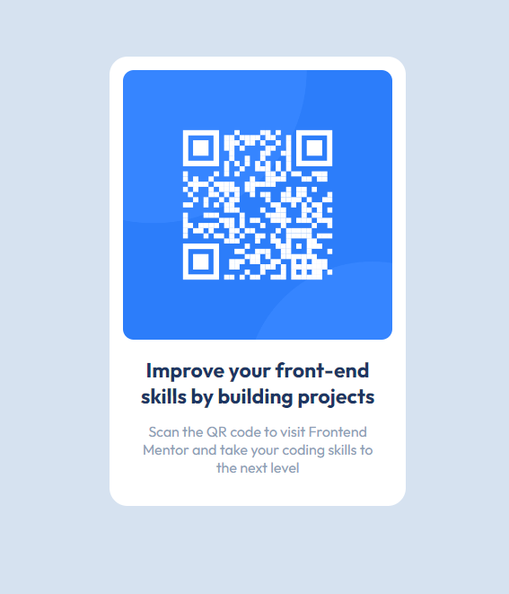

# Frontend Mentor - QR code component solution

This is a solution to the [QR code component challenge on Frontend Mentor](https://www.frontendmentor.io/challenges/qr-code-component-iux_sIO_H). Frontend Mentor challenges help you improve your coding skills by building realistic projects.

## Table of contents

- [Screenshot](#screenshot)
- [Links](#links)
- [Built with](#built-with)
- [What I learned](#what-i-learned)
- [Continued development](#continued-development)
- [Useful resources](#useful-resources)
- [Author](#author)

### Screenshot

### Links

- Live Site URL: [Add live site URL here](https://your-live-site-url.com)

### Built with

- Non-semantic HTML5 markup
- CSS custom properties
- Flexbox
- Mobile-first workflow
- [React](https://reactjs.org/) - JS library

### What I learned

In this project i learned, how to build cards with modern design, that can be used for displaying different information.

### Continued development

Positioning items on the page. In the future i want to improve my item positioning on the page. I would like also dive deeper in difference styling concepts, that can makes my projects prettier.

### Useful resources

- [ resource 1](https://www.google.com) - This helped me much
- [ stackoverflow](https://stackoverflow.com/) - there`s a lot of answers, that help me time to time

## Author

- Website - [Add your name here](https://www.your-site.com)
- Frontend Mentor - [@yourusername](https://www.frontendmentor.io/profile/hryndi)
